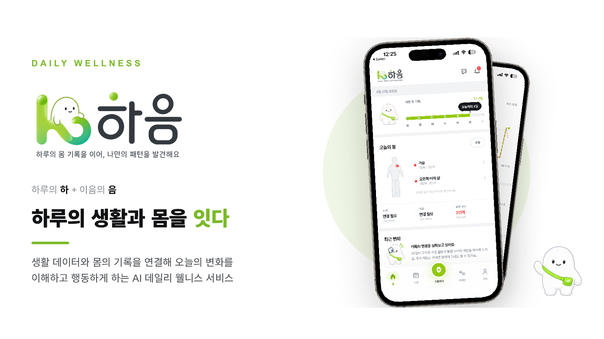
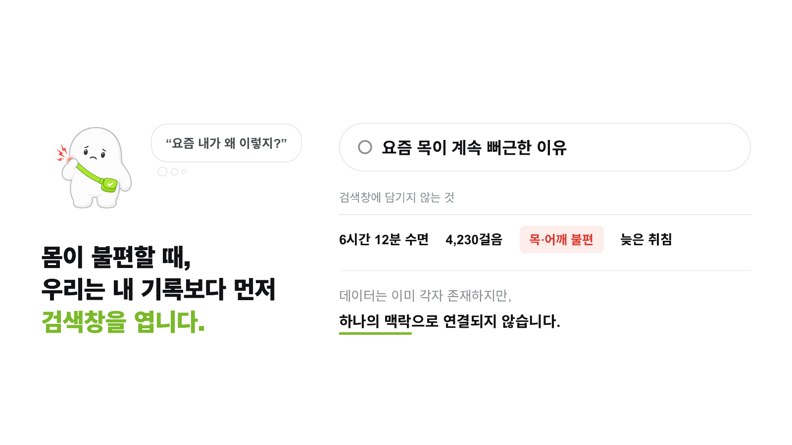
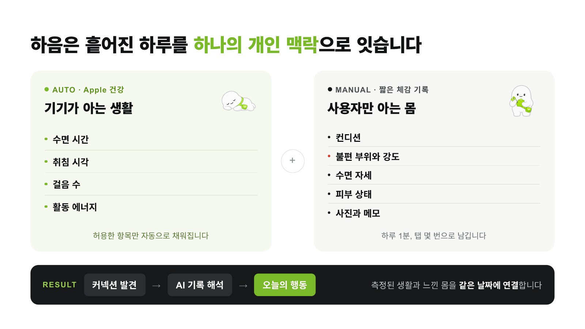
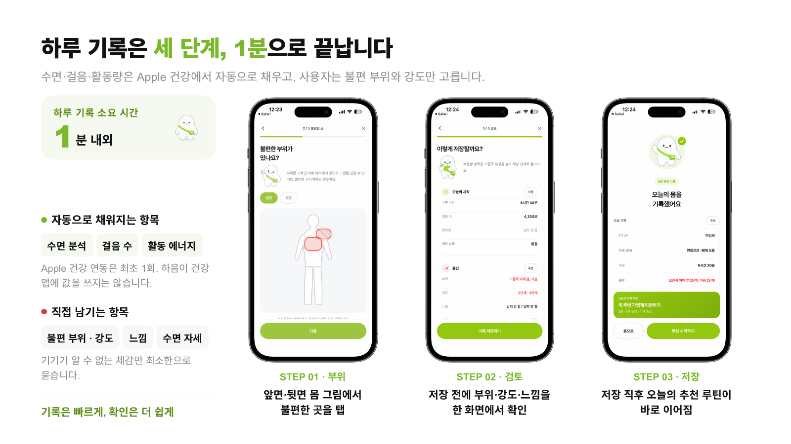
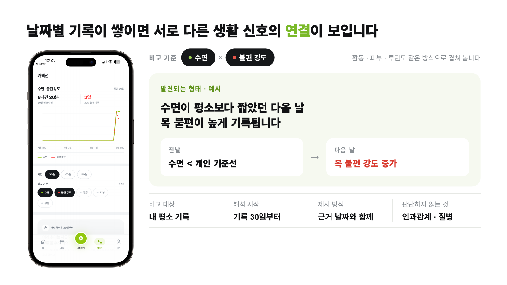
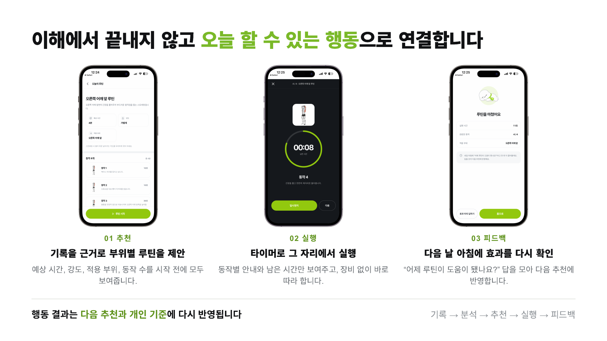
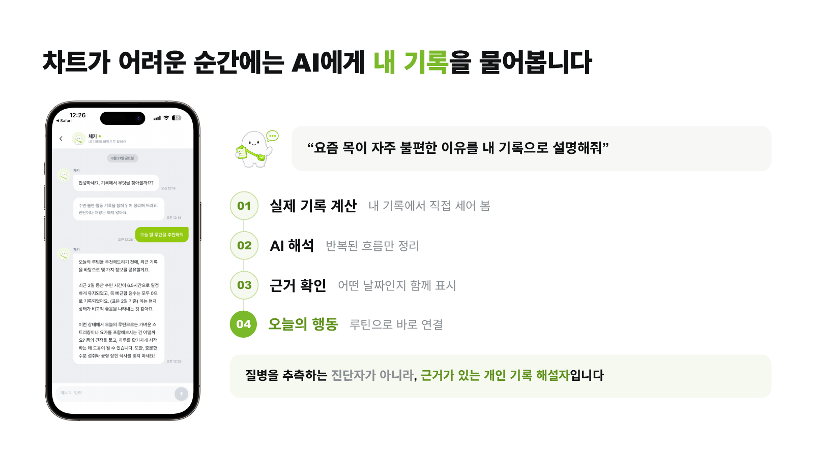

 

### 다르게 모여, 하나로 완성하다.

`합`에는 **함께한다는 의미**를, `.zip`에는 **각자의 아이디어와 역량을 하나로 담는다는 의미**를 담았습니다. 
역할의 경계보다 서로의 관점을 연결하며, 좋은 경험을 함께 만들어갑니다.

 

### Team

<table>
  <tr>
    <td align="center" width="120">
       
      <strong>김정윤</strong> Backend
    </td>
    <td align="center" width="120">
       
      <strong>김은건</strong> Backend
    </td>
    <td align="center" width="120">
       
      <strong>박서진</strong> Backend
    </td>
    <td align="center" width="120">
       
      <strong>서동섭</strong> Frontend
    </td>
    <td align="center" width="120">
       
      <strong>손영인</strong> Backend
    </td>
  </tr>
</table>

 

---

### FEATURED PROJECT · 하음

**하루의 생활과 몸을 잇다** 
생활 데이터와 몸의 기록을 연결해 오늘의 변화를 이해하고 행동하게 하는 AI 데일리 웰니스 서비스

 

 

  

> **하음은 진단을 대신하지 않습니다.** 
> 흩어진 나의 기록을 한곳에 모아, 반복되는 흐름과 오늘 실천할 행동을 알려줍니다.

 

<table>
  <tr>
    <td width="33.3%" valign="top">
      <strong>01 · Record</strong>  
      생활 데이터는 자동으로 채우고, 기기가 알 수 없는 몸의 체감만 짧게 기록합니다.
    </td>
    <td width="33.3%" valign="top">
      <strong>02 · Connect</strong>  
      수면·활동·불편 정도를 내 평소 기록 위에서 비교해 반복되는 신호를 찾습니다.
    </td>
    <td width="33.3%" valign="top">
      <strong>03 · Act</strong>  
      AI가 근거와 함께 오늘의 짧은 루틴을 제안하고, 결과는 다음 추천에 반영됩니다.
    </td>
  </tr>
</table>

 

### 하루의 기록이, 나만의 패턴이 되기까지

<table>
  <tr>
    <td width="50%"></td>
    <td width="50%"></td>
  </tr>
  <tr>
    <td align="center">흩어진 생활 데이터와 몸의 기록</td>
    <td align="center">기록에서 행동까지 이어지는 서비스 흐름</td>
  </tr>
</table>

 

### Core Experience

  

<strong>기록하고 · 연결하고 · 행동합니다.</strong>

 

<table>
  <tr>
    <td width="48%" valign="middle">
      <h3>AI, 내 기록을 가장 잘 아는 해설자</h3>
      일반적인 답을 먼저 제시하는 대신, 실제 기록에서 반복된 흐름을 정리해 근거가 되는 날짜와 함께 설명합니다.  
      <strong>진단자가 아닌, 개인 기록 해설자.</strong>
    </td>
    <td width="52%"></td>
  </tr>
</table>

 

---

### Tech Stack

 

 

  

© HAP.zip · Built together, shipped together.

